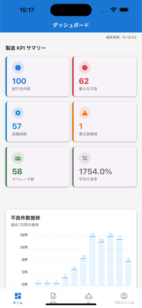

# Defect Report AI - Mobile App

製造業向け不良品分析AIエージェントのモバイルアプリケーション（React Native / Expo）

## 概要

このモバイルアプリは、工場の現場作業者や品質管理担当者が、スマートフォンから不良品データの入力・確認・AI分析を行うためのアプリケーションです。

### 主な機能

- **ダッシュボード**: KPI表示、不良トレンドチャート、機械別ステータス
- **AIチャット**: 不良品データに関する自然言語での質問・分析
- **不良入力**: 手動での不良品レポート入力（画像添付対応）
- **セッション永続化**: 一度ログインすれば、アプリを閉じても再ログイン不要

## スクリーンショット

| ダッシュボード | 不良入力 |
|:-------------:|:-------:|
|  |  |
| KPIサマリー、不良件数推移グラフ | 不適合報告入力フォーム |

### Webアプリ - ダッシュボード

Webアプリのダッシュボードは、より詳細なデータ可視化と分析機能を提供します。


## 技術スタック

| カテゴリ | 技術 |
|---------|------|
| フレームワーク | React Native / Expo SDK 52 |
| 言語 | TypeScript |
| 認証 | JWT (Access Token + Refresh Token) |
| トークン保存 | expo-secure-store |
| ナビゲーション | React Navigation 7 |
| UIライブラリ | React Native Paper |
| チャート | react-native-chart-kit |
| HTTP Client | Axios |
| E2Eテスト | Maestro |

## セットアップ

### 前提条件

- Node.js 18+
- npm または yarn
- Expo CLI (`npm install -g expo-cli`)
- iOS: Xcode 15+ (Mac のみ)
- Android: Android Studio

### インストール

```bash
# リポジトリをクローン
git clone git@github.com:luvwinnie/defect_report_ai_app.git
cd defect_report_ai_app

# 依存関係をインストール
npm install
```

### 環境設定

`src/services/api.ts` でAPIエンドポイントを設定：

```typescript
// ローカル開発（シミュレータ）
const API_BASE_URL = 'http://localhost:80';

// 実機テスト（ngrok経由）
const API_BASE_URL = 'https://your-ngrok-url.ngrok-free.app';
```

### 起動

```bash
# Expo開発サーバー起動
npm start

# iOSシミュレータで起動
npm run ios

# Androidエミュレータで起動
npm run android

# Webブラウザで起動
npm run web
```

## プロジェクト構造

```
.
├── App.tsx                 # アプリエントリーポイント
├── app.json               # Expo設定
├── package.json           # 依存関係
├── tsconfig.json          # TypeScript設定
├── assets/                # アイコン・画像
├── src/
│   ├── components/        # 再利用可能なUIコンポーネント
│   │   ├── ChatMessage.tsx
│   │   ├── DefectListItem.tsx
│   │   ├── DefectTrendsChart.tsx
│   │   ├── KPICard.tsx
│   │   ├── LoadingScreen.tsx
│   │   ├── MachineStatusChart.tsx
│   │   └── SeverityChip.tsx
│   ├── contexts/          # React Context
│   │   └── AuthContext.tsx
│   ├── navigation/        # ナビゲーション設定
│   │   ├── AppNavigator.tsx
│   │   ├── AuthStack.tsx
│   │   └── MainTabs.tsx
│   ├── screens/           # 画面コンポーネント
│   │   ├── AIChatScreen.tsx
│   │   ├── DashboardScreen.tsx
│   │   ├── DefectInputScreen.tsx
│   │   ├── LoginScreen.tsx
│   │   └── ProfileScreen.tsx
│   ├── services/          # APIサービス
│   │   └── api.ts
│   ├── theme/             # テーマ設定
│   │   └── index.ts
│   └── types/             # TypeScript型定義
│       └── index.ts
└── .maestro/              # E2Eテスト
    ├── config.yaml
    ├── 01_login_flow.yaml
    ├── 02_dashboard_flow.yaml
    ├── 03_chat_flow.yaml
    ├── 04_defect_input_flow.yaml
    └── 05_full_user_journey.yaml
```

## 認証フロー

このアプリはJWT認証を使用し、セッション永続化を実現しています：

```
┌─────────────────────────────────────────────────────────────┐
│                    認証フロー                                │
├─────────────────────────────────────────────────────────────┤
│                                                             │
│  1. ログイン                                                │
│     POST /api/auth/mobile/login                            │
│     → Access Token (15分) + Refresh Token (7日) を取得     │
│     → SecureStore に保存                                   │
│                                                             │
│  2. API リクエスト                                          │
│     Authorization: Bearer <access_token>                   │
│                                                             │
│  3. Access Token 期限切れ時                                 │
│     POST /api/auth/mobile/refresh                          │
│     → 新しい Access Token + Refresh Token を取得           │
│     → Token Rotation でセキュリティ強化                     │
│                                                             │
│  4. アプリ再起動時                                          │
│     → SecureStore から Token を復元                        │
│     → 自動的にログイン状態を維持                           │
│                                                             │
└─────────────────────────────────────────────────────────────┘
```

### モバイル専用エンドポイント

| エンドポイント | 説明 |
|---------------|------|
| `POST /api/auth/mobile/login` | ログイン（トークンをボディで返却） |
| `POST /api/auth/mobile/refresh` | トークンリフレッシュ（ボディでトークン受け取り） |

Web版との違い：
- Web: HttpOnly Cookie でトークン管理（XSS対策）
- Mobile: レスポンスボディでトークン返却 → SecureStore に保存

## 画面説明

### 1. ログイン画面
- ユーザー名とパスワードでログイン
- 認証成功後、トークンを SecureStore に保存

### 2. ダッシュボード
- 総不良件数、本日の不良件数、不良率、MTBF
- 過去7日間の不良トレンドチャート
- 機械別ステータス（正常/警告/エラー）

### 3. AIチャット
- 不良品データに関する自然言語での質問
- 例：「今週最も多い不良の種類は？」「CNC-001の不良傾向を教えて」

### 4. 不良入力
- 不良品情報の手動入力
- 機械選択、不良タイプ、重要度、説明
- 画像添付機能（カメラ/ギャラリー）

### 5. プロフィール
- ユーザー情報表示
- ログアウト機能

## E2Eテスト

Maestro を使用したE2Eテスト：

```bash
# Maestro インストール
curl -Ls "https://get.maestro.mobile.dev" | bash

# 全テスト実行
maestro test .maestro/

# 個別テスト実行
maestro test .maestro/01_login_flow.yaml
```

### テストフロー

1. `01_login_flow.yaml` - ログイン機能
2. `02_dashboard_flow.yaml` - ダッシュボード表示
3. `03_chat_flow.yaml` - AIチャット機能
4. `04_defect_input_flow.yaml` - 不良入力機能
5. `05_full_user_journey.yaml` - 統合テスト

## バックエンドとの連携

このアプリは以下のバックエンドと連携します：

- **リポジトリ**: [defect_report_ai](https://github.com/luvwinnie/defect_report_ai)
- **API**: FastAPI
- **認証**: JWT (python-jose + passlib)
- **データベース**: PostgreSQL (認証), Neo4j (ナレッジグラフ)

### バックエンド起動方法

```bash
# バックエンドリポジトリで
docker compose up -d

# ngrok でトンネル作成（実機テスト用）
ngrok http 80
```

## トラブルシューティング

### ログインできない

1. バックエンドが起動しているか確認
2. API URLが正しいか確認
3. ngrok URLが最新か確認（無料版は毎回変わる）

### トークンリフレッシュが失敗する

1. Refresh Token の有効期限（7日）を確認
2. バックエンドのログでエラーを確認

### シミュレータで動かない

```bash
# Expo キャッシュクリア
npx expo start --clear

# node_modules 再インストール
rm -rf node_modules && npm install
```

## ライセンス

MIT License

## 貢献

1. Fork
2. Feature branch 作成 (`git checkout -b feature/amazing-feature`)
3. Commit (`git commit -m 'Add amazing feature'`)
4. Push (`git push origin feature/amazing-feature`)
5. Pull Request 作成
